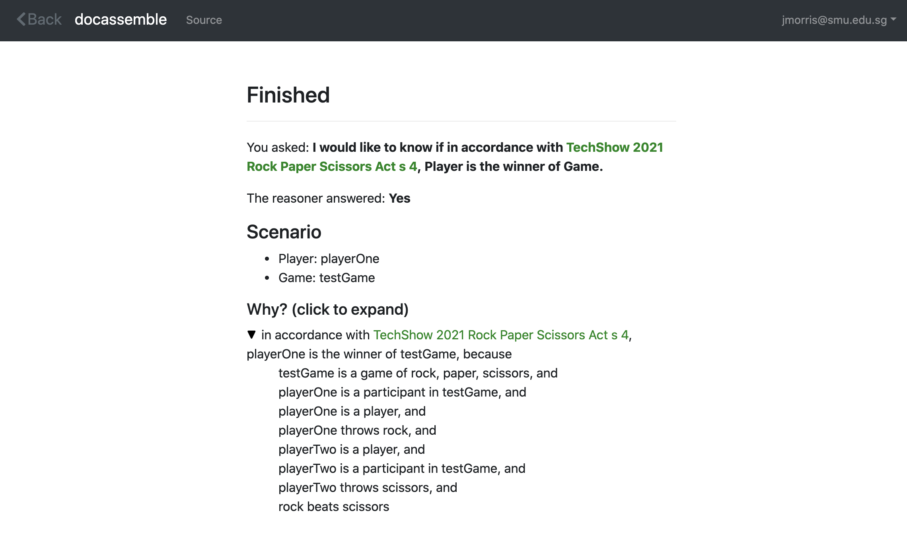

# docassemble-DADataType

This module allows you to rapidly prototype Docassemble interviews that rely on s(CASP) encodings of laws,
and simple data structures, and can provide natural langauge explanations for their conclusions.

## Installation

It can be installed inside your docassemble package manager by providing the address for this github repository.

You need to install s(CASP) on your docassemble server, and may need to modify DAScasp.py to point to where it has been installed.

## Use

### Create an s(CASP) Encoding, and an s(CASP) Query

For details on s(CASP) see here.

The example file rps.pl in this package reads as follows:

```
#pred game(X) :: '@(X) is a game of rock, paper, scissors'.
#pred player(X) :: '@(X) is a player'.
#pred participant_in(X,Y) :: '@(X) is a participant in @(Y)'.
#pred sign(X) :: '@(X) is a sign'.
#pred beats(X,Y) :: '@(X) beats @(Y)'.
#pred player_throw(X,Y) :: '@(X) throws @(Y)'.
#pred winner(X,Y) :: 'in accordance with {TechShow 2021 Rock Paper Scissors Act s 4}, @(X) is the winner of @(Y)'.

sign(rock).
sign(paper).
sign(scissors).
beats(rock,scissors).
beats(scissors,paper).
beats(paper,rock).

winner(Player1,Game) :-
    game(Game),
    participant_in(Player1,Game),
    player(Player1),
    player_throw(Player1,Throw1),
    player(Player2),
    participant_in(Player2,Game),
    player_throw(Player2,Throw2),
    beats(Throw1,Throw2),
    Player1 \= Player2.
```

### Write a Data Structure YAML file

The example demo.yml file in this package reads as follows:

```
rules: rps.pl
query: winner(Player,Game)
data:
  - name: game
    type: String
    encodings:
    - game(X)
    minimum: 1
    attributes:
      - name: player
        type: String
        encodings:
          - player(X)
          - participant_in(X,Y)
        exactly: 2
        attributes:
          - name: throw
            type: Enum
            encodings:
              - player_throw(Y,X)
            exactly: 1
            options:
              rock: Rock
              paper: Paper
              scissors: Scissors
terms:
- TechShow 2021 Rock Paper Scissors Act s 4: s 4 - The winner is the player whose throw beats the other player’s throw. ([Source](http://www.canlii.org))
```

Note that it must include a `rules:` element with the name of the encoding in the static folder, and a `query:` element with the text of an s(CASP)
query (final period ommitted). If you want to use defined terms inside your Docassemble interview, you can add them as a list under `terms:`, but
that is optional.

It must also have an element `data:` which sets out the data structure for the elements in your interview.  `data:` is a list, and each item in the list
is a dictionary that must have a `type:` and a `name:`. The types can be any of `String, Number, Date, DateTime, Time, Number, Email, YesNoMaybe, Continue, or Object`.
Each element in the dictionary can also have `minimum:`, `maximum:`, and `exactly:` entries indicating how many of that element should be collected.
If you have an `exactly` or `maximum` higher than 1, or a `minimum` and no maximum, the element will be collected as a Docassemble list.

Individual Objects and elements of lists can have attributes, which can have all the same settings.

An element of type `Object` should have an attribute `source:` that gives the name of the root list from which its objects are selected.
An element of type `Enum` should have an attribute `options:` which is a dictionary of options to be selected.

Objects can have `encodings:`, which are s(CASP) statements (ommitting the final period) of arity 0, 1, or 2. The variables in these statements are limited to `X`, and `Y`.
`X` will be replaced with the value of the object, and `Y` will be replaced with the value of the parent object, if any.

### Generate the Interview

Save the YAML to a file, and pass that filename to the generate_interview() function in IntGen.py, which will return the text of a Docassemble interview. Save that to the
Docasseble server and run it.

The example file above will generate an interview that proceeds as follows:

> Q: Is there a game?
>
> A: Yes
>
> Q: What is first game?
>
> A: testGame
>
> Q: What is first player of the first game?
>
> A: playerOne
>
> Q: Select throw of the first player of the first game
>
> A: Rock
>
> Q: What is second player of the first game?
>
> A: playerTwo
>
> Q: Select throw of the second player of the first game
>
> A: Scissors
>
> Q: Is there another game?
>
> A: No

And the following screen is displayed:


